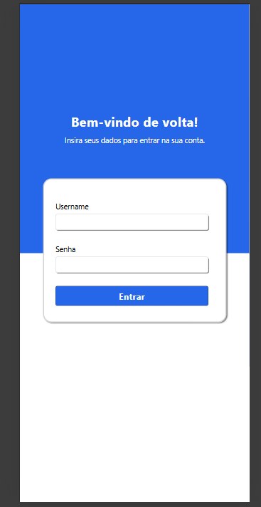
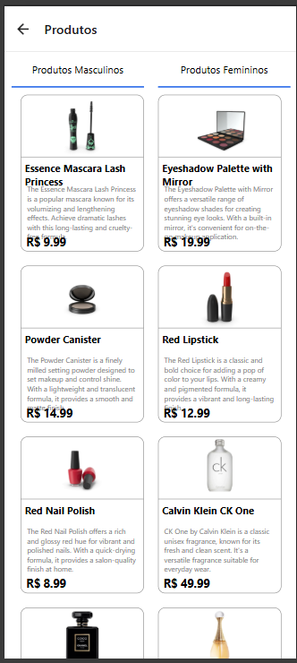
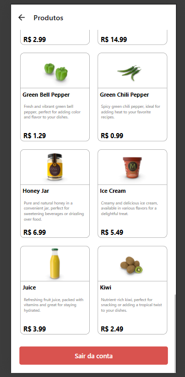
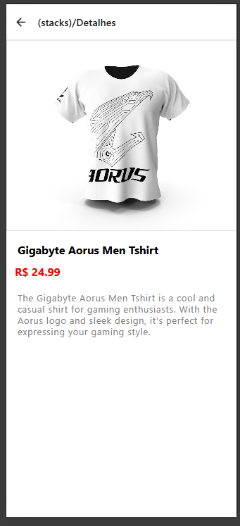

# 📱 Estudo de caso mobile development UniFecaf (React Native)


Aplicativo desenvolvido em React Native com TypeScript, Redux e integração API.

## ✨ Features
- Catálogo de produtos (masculino/feminino)
- Tela de login com validação
- Detalhes de produtos
- Integração com [DummyJSON](https://dummyjson.com/)
- Gerenciamento de estado com Redux Toolkit
- Navegação com Expo Router

## 🛠 Tech Stack
| Tecnologia       | Descrição                          |
|------------------|------------------------------------|
| React Native     | Framework mobile                   |
| TypeScript       | Tipagem estática                   |
| Expo             | Plataforma de desenvolvimento      |
| Redux Toolkit    | Gerenciamento de estado            |
| Axios            | Requisições HTTP                   |
| Expo Router      | Navegação entre telas              |

## 🚀 Getting Started

### Pré-requisitos
- Node.js (v18+)
- Expo CLI (`npm install -g expo-cli`)
- Yarn ou npm

### Instalação
```
git clone https://github.com/dilok5/Estudo-de-caso-mobile-development.git
cd Estudo-de-caso-mobile-development
yarn install
# ou
npm install
expo start
```

## 🔐 Credenciais de Teste
**Usuário:** `admin`  
**Senha:** `123`

## 📸 Screenshots

<div align="center" style="display: flex; flex-wrap: wrap; gap: 10px; justify-content: center;">
  
  
  
  
</div>
